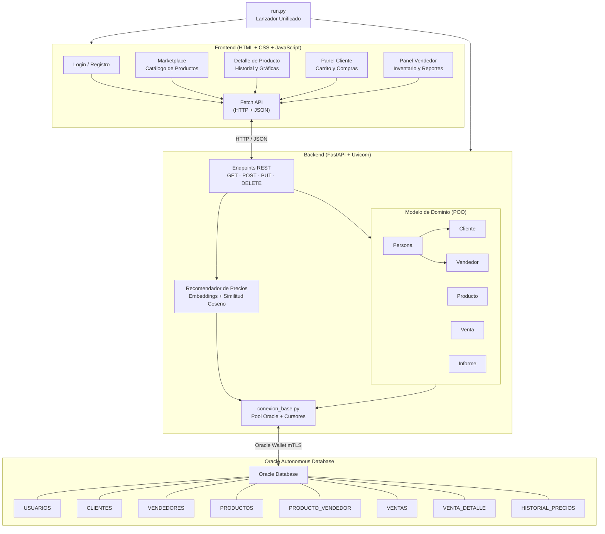
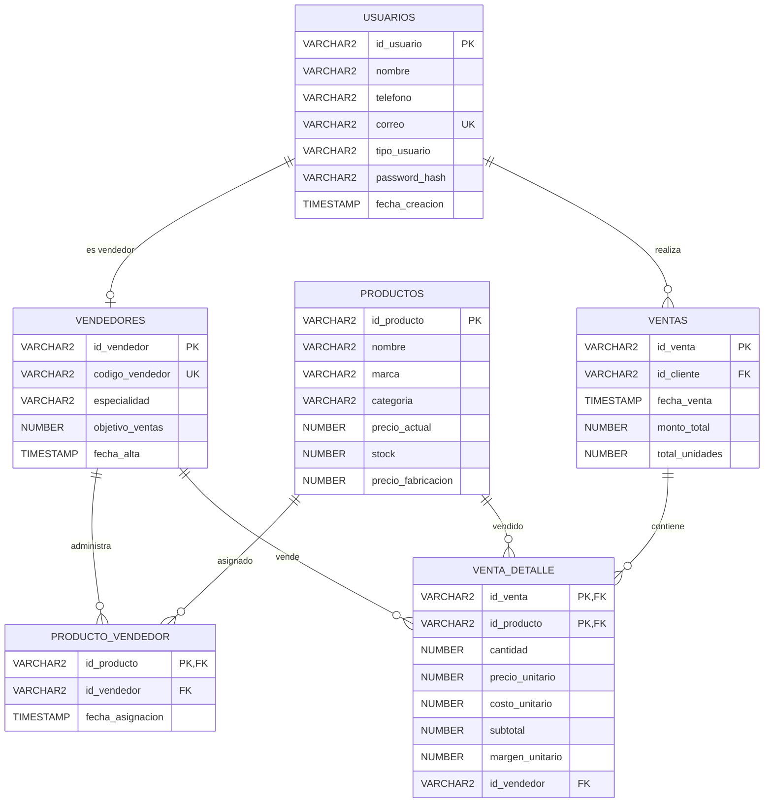

# NexusMarket — Sistema de Marketplace Inteligente

Plataforma de comercio electrónico con análisis de precios, recomendación basada en similitud semántica y reportes financieros. Backend en Python/FastAPI + Oracle Autonomous Database, frontend HTML/JS vanilla.

---

## Arquitectura



---

## Requisitos

- Python 3.10 o superior
- Oracle Autonomous Database (ADB) con wallet de conexión
- Navegador web moderno
- Conexión a internet (para carga inicial de modelos ML)

## Instalación

### 1. Clonar el repositorio

```bash
git clone <https://github.com/arturobuttanda/daad_project.git> nexusmarket
```

### 2. Configurar variables de entorno

El env es donde deben de estar las credenciales, en principio no deberia de haber problema porque no puse el env en el git ignore, pero si da problemas entonces solo es crear un archivo .env en la raiz del directorio y colocar

```env
DB_USER="ADMIN"
DB_PASSWORD="Bufalo4135241352"
DB_DSN="e8x9v8j6g8i1m0ms_low"
WALLET_PATH="Backend/ConexionDB/Wallet"
WALLET_PASSWORD="Bufalo4135241352"
FRONTEND_URL="http://localhost:5180"
```


### 3. Base de datos

La base de datos que se ocupa es la de Oracle Autonomous Database, la conexion esta dentro de del Backend/ConexionDB
las credenciales de la base ya se encuentran en dentro de la carpeta en Wallet, deben ser los archivos:

 Wallet/
  cwallet.sso
  ewallet.p12
  ewallet.pem
  keystore.jks
  ojdbc.properties
  README
  sqlnet.ora
  transnames.ora
  truststore.jks
### 4. Iniciar la aplicación

Ejecuta el lanzador desde la raíz del proyecto:

```bash
python run.py
```

Esto:
1. Crea/activa un entorno virtual (`.venv`)
2. Instala dependencias de `requirements.txt`
3. Inicia el backend (uvicorn en `:8000`)
4. Espera a que el backend responda (vía `GET /api/ping`)
5. Inicia un servidor de archivos estáticos para el frontend en `:5180`
6. Abre el navegador en la página de inicio de sesión

### 5. Acceder

| Componente | URL |
|---|---|
| Frontend | http://127.0.0.1:5180/iniciar-sesion.html |
| Backend API | http://127.0.0.1:8000 |

Se debe de acceder a la url del fronted

Dentro del fronted lo primero que veremos sera la estructura del login, ahi se puede registrar un nuevo usuario como vendedor o cliente, pero esos nuevos vendedores van a estar vacios, y hay que poblarlos para poder probar algunas funcionalidades de analisis, por eso recomiendo que se ingresen las siguientes credenciales:
```
Vendedor
nombre: Pablo Marmol
correo: pablomarmol@gmail.com
contrasena: "C0ntraseña"

Cliente
nombre: Pedro PicaPiedra
correo: 
pedropp@gmail.com
contrasena: "C0ntraseña"
```

## Estructura del proyecto

```
NexusMarket/
├── Backend/
│   ├── app.py                     # API REST (FastAPI)
│   ├── conexion_base.py           # Capa de datos (Oracle)
│   ├── modelo_poo.py              # Modelos del dominio (POO)
│   ├── ConexionDB/                # (residual)
│   ├── RecoleccionDatos/          # (residual)
│   ├── recomendacion_precio/
│   │   ├── __init__.py
│   │   └── recomendador_precio.py # TF-IDF + SentenceTransformer
│   └── scripts/
│       ├── schema.sql             # DDL completo
│       ├── seed_demo_data.py      # Poblado de datos demo
│       └── importar_csv_oracle.py # Importación desde CSV
├── Frontend/
│   ├── iniciar-sesion.html        # Login
│   ├── registrarse.html           # Registro
│   ├── index.html                 # Inicio
│   ├── cliente/
│   │   ├── marketplace.html       # Catálogo de productos
│   │   ├── producto.html          # Detalle + gráficas + historial
│   │   └── historial.html         # Historial de compras
│   ├── vendedor/
│   │   ├── inventario.html        # CRUD de productos
│   │   └── reporte.html           # Reportes financieros
│   ├── js/
│   │   ├── api.js                 # Cliente HTTP (fetch)
│   │   ├── carrito.js             # Carrito (localStorage)
│   │   └── utilerias.js           # Utilidades compartidas
│   └── css/
│       └── estilo.css             # Estilos globales
├── EDA/
│   ├── analisis.ipynb             # Notebook de análisis exploratorio
│   └── *.csv                       # Datos de respaldo
├── Recursos de prueba/             # Capturas y assets de respaldo
├── run.py                         # Lanzador unificado
├── requirements.txt               # Dependencias Python
├── .env.example                   # Template de configuración
└── README.md
```

---

## API Endpoints

### Autenticación

| Método | Ruta | Descripción |
|---|---|---|
| POST | `/api/auth/register` | Registrar usuario (cliente o vendedor) |
| POST | `/api/auth/login` | Iniciar sesión |
| PUT | `/api/auth/profile` | Actualizar nombre/contraseña |

### Productos (Cliente)

| Método | Ruta | Descripción |
|---|---|---|
| GET | `/api/cliente/productos` | Listar productos (paginado, búsqueda, filtro categoría) |
| GET | `/api/cliente/productos/{id}` | Detalle del producto + historial de precios |
| GET | `/api/productos/categorias` | Listar categorías disponibles |

### Compras (Cliente)

| Método | Ruta | Descripción |
|---|---|---|
| POST | `/api/cliente/compras` | Realizar compra (carrito multi-item) |
| GET | `/api/cliente/compras` | Historial de compras del cliente (paginado, por período) |
| GET | `/api/cliente/compras/{id}` | Ticket de una compra específica |

### Productos (Vendedor)

| Método | Ruta | Descripción |
|---|---|---|
| GET | `/api/vendedor/productos` | Listar productos del vendedor |
| POST | `/api/productos` | Crear producto |
| PUT | `/api/productos/{id}` | Actualizar producto |
| DELETE | `/api/productos/{id}` | Eliminar producto |
| POST | `/api/productos/recomendacion-precio` | Recomendar precio por similitud semántica |

### Reportes (Vendedor)

| Método | Ruta | Descripción |
|---|---|---|
| GET | `/api/vendedor/reportes/indicadores` | Indicadores financieros (ingresos, costos, margen) |
| GET | `/api/vendedor/reportes/ventas-mensuales` | Ventas agregadas por mes |
| GET | `/api/vendedor/reportes/productos-estancados` | Productos sin ventas recientes |
| GET | `/api/vendedor/reportes/top-productos` | Productos más vendidos |
| GET | `/api/vendedor/reportes/ventas/csv` | Exportar ventas a CSV |


---

## Esquema de base de datos



---

## Funcionamiento interno

### Flujo de compra

1. El cliente navega el marketplace (`GET /api/cliente/productos`).
2. Agrega productos al carrito (almacenado en `localStorage` via `carrito.js`).
3. Al pagar, el frontend envía `POST /api/cliente/compras` con `{id_cliente, items: [{id_producto, cantidad}]}`.
4. El backend valida el cliente, bloquea filas con `FOR UPDATE`, verifica stock, descuenta inventario e inserta en `VENTAS` + `VENTA_DETALLE` en una transacción.
5. Cada item se asigna al vendedor que lo publicó (desde `PRODUCTO_VENDEDOR`).

### Recomendación de precio

1. `RecomendadorPrecio` usa `SentenceTransformer` para generar embeddings del nombre/marca/categoría del producto.
2. Calcula similitud coseno contra el catálogo para encontrar productos similares.
3. Sugiere un precio basado en el promedio de productos semánticamente cercanos.

### Reportes financieros

- **Indicadores**: suma ingresos (`subtotal`), costos (`costo_unitario`) y calcula margen desde `VENTA_DETALLE`.
- **Ventas mensuales**: agrupa por mes usando `TRUNC(fecha_venta, 'MM')`.
- **Productos estancados**: productos del vendedor con `SUM(cantidad) = 0` en el período (con `HAVING COALESCE(SUM(d.cantidad), 0) > 0` para excluir los que nunca se vendieron).
- **Top productos**: ordena por cantidad vendida descendente.

### Gráficas del detalle de producto

- **Historial de precios**: dos modalidades:
  - *Histórico*: todos los registros (ordenados ASC).
  - *Mensual*: promedia los precios por mes calendario.
- Rango de fechas opcional via query params `fecha_inicio` y `fecha_fin`.

---
## Flujo de trabajo para exposición

### 1. Ciclo completo: Registro → Compra → Reporte

```
Registrar Vendedor ──→ Agregar Productos ──→ Ver Reportes
                                                    │
Registrar Cliente ───→ Marketplace ──→ Carrito ──→ Compra
                                                    │
                                              Historial (Ticket)
```

### 2. Pruebas recomendadas que hacer para probar el proyecto :)

**A. Registrar un vendedor**
1. Ir a `/registrarse.html`, seleccionar "Vendedor", llenar datos.
2. Iniciar sesión como vendedor → redirige al panel de inventario.
3. Crear 2-3 productos con diferentes categorías y precios.

**B. Registrar un cliente**
1. Cerrar sesión, ir a `/registrarse.html`, seleccionar "Cliente".
2. Iniciar sesión como cliente → redirige al marketplace.

**C. Marketplace y compra**
1. Ver productos listados con stock > 0.
2. Usar búsqueda por nombre/marca y filtro por categoría.
3. Abrir detalle de producto → ver historial de precios (gráfica histórica y mensual).
4. Agregar productos al carrito, ajustar cantidades.
5. Pagar → muestra ticket con vendedor por item.

**D. Historial de compras**
1. Ir a "Pedidos" para ver el historial (paginado, filtro por período).
2. Abrir ticket de una compra → ver detalle con vendedor asignado.

**E. Reportes de vendedor**
1. Iniciar sesión como vendedor → ir a reportes.
2. Ver indicadores: ingresos totales, costos, margen, stock bajo.
3. Ver ventas mensuales (gráfica de barras).
4. Ver top productos y productos estancados.


